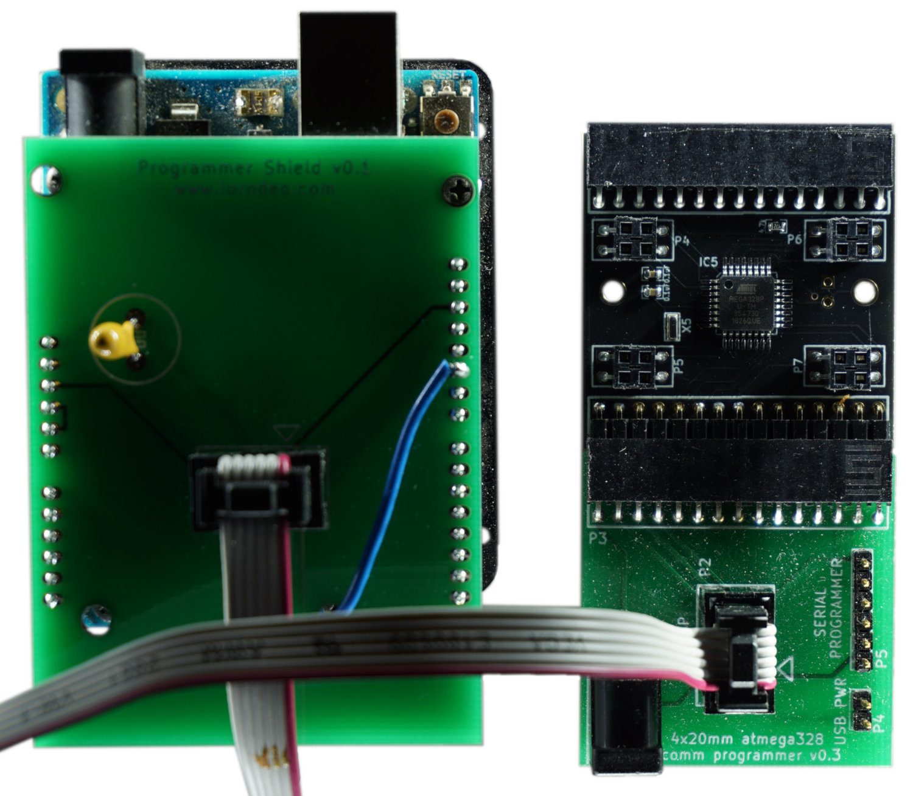
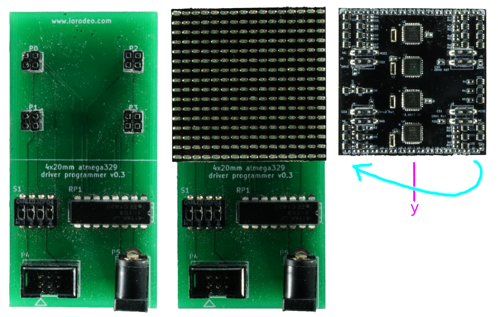
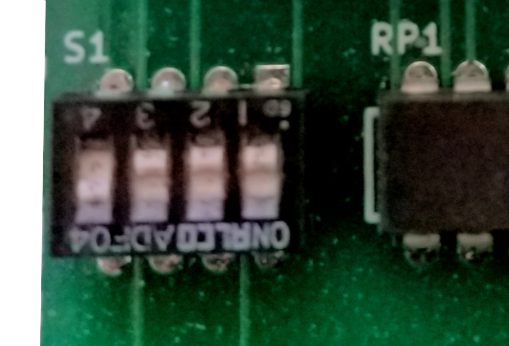

Software running on micro controller units (MCU) is considered firmware. The document guides you from obtaining the hardware to make the comm and driver panel work.

1. TOC
{:toc}

# Firmware

The [driver](../../Panel/docs/driver.md) and [comm board](../../Hardware/docs/comm.md) use a total of five micro controller units (MCUs). To program these five ATmega328, you will need the [programmer](programmer.md) explained in the [acquisition](../../../docs/G4-Acquisition.md) step. This text explains, how an Arduino can be used as a ["In-circuit Serial Programmer" (ISP)](#isp) to flash the firmware to [the driver](#driver) and the [comm board](#comm).

## Prerequisites

You will need the following parts:

- [driver board](../../Panel/docs/driver.md)
- [comm board](../../Hardware/docs/comm.md)
- [Arduino](../../../docs/G4-COTS.md#arduino-uno)
- [Arduino shield](programmer.md#arduino)
- [driver board shield](programmer.md#driver)
- [comm board shield](programmer.md#comm)
- (Windows) computer

Install the [custom version of the Arduino IDE](https://github.com/floesche/panels_g4_firmware/releases/download/arduino-1.6.5-r5/arduino-panelsg4-1.6.5-r5.zip) on your computer. This IDE has the PanelsG4 board added as a target. The Windows version of Arduino-1.6.5 is provided as an asset to "Customized Arduino IDE" release on github.

{::comment}
TODO: Possibly provide alternative
{:/comment}

## Turn Arduino into In-circuit Serial Programmer (ISP)
{:#isp}

To flash the firmware to the panel MCUs, the Arduino will act as a programmer. For this the Arduino requires a special firmware, which is provided as "example" code. Follow these steps to turn the Arduino into an ISP.

1. Connect Arduino (Make sure programmer shield is off it will prevent programming)
1. Open Arduino IDE.
1. Go to *Tools*{:.gui-txt} ­→ *Board*{:.gui-txt} and select *Arduino UNO*{:.gui-txt}.
1. Go to *Tools*{:.gui-txt} ­→ *Port*{:.gui-txt} and select correct Port
1. Go to *File*{:.gui-txt} ­→ *Examples*{:.gui-txt} select *ArduinoISP*{:.gui-txt}
1. *Verify*{:.gui-btn} (check button) and *Upload*{:.gui-btn} (right point arrow button).

These steps should be similar to what is described in an [Arduino tutorial online](https://www.arduino.cc/en/Tutorial/BuiltInExamples/ArduinoISP).

## Troubleshooting

There is no verbose output that helps debugging problems, but one of the three following steps solved most problems in the past:

1. Make sure that the Arduino firmware has not been corrupted. [Flashing the ISP firmware to the Arduino](#isp) again solved many unexplained problems.
1. Make sure you driver and comm boards are connected in the correct way. It's easy to mix up polarity which, in the worst case, can corrupt a panel but is often solved by using the correct polarity.
1. Makes sure only one subdevice is selected on the [driver board](#driver). Multiple selections can lead to unexpected results.

# Programming a comm panel
{:#comm}

Each [comm board](../../Hardware/docs/comm.md) needs to be programmed.

The following has to be done only once for all comm boards: In the the Arduino IDE and go to *Tools*{:.gui-txt} ­→ *Board*{:.gui-txt} and select *PanelG4*{:.gui-txt}. In *Tools*{:.gui-txt} ­→ *Programmer*{:.gui-txt} you need to select *Arduino as ISP*{:.gui-txt} (not ArduinoISP).

## Connect comm board

{:.ifr .pop}

To program the ATMega328 on a comm board, connect the board to the comm shield board in a way, that you can see the components on both boards (also see image). There is no need to connect the external power supply, power is provided through the Arduino shield.

## Flash comm board firmware
{:.clear}

Once the comm board is attached to the comm shield, you can connect the comm shield to the Arduino shield with the ribbon cable. Make sure to disconnect the ribbon cable when changing the comm boards.

With the Arduino IDE open, select *Tools*{:.gui-txt} ­→ *Burn Bootloader*{:.gui-txt} to write the boot loader to the comm board's MCU. With the correct `comm.ino` open (the latest version is in [`hardware_v0p2/comm/`](https://github.com/floesche/panels_g4_firmware/tree/master/hardware_v0p2/comm)), select *Sketch*{:.gui-txt} ­→ *Upload Using Programmer*{:.gui-txt}. Now the comm board should be fully functional. Disconnect the ribbon cable before programming the next comm board.

## Checklist

1. Connect Arduino shield to the computer[^1]
1. Open Arduino IDE
1. Go to *Tools*{:.gui-txt} ­→ *Board*{:.gui-txt} and select *PanelG4*{:.gui-txt}
1. Go to *Tools*{:.gui-txt} ­→ *Programmer*{:.gui-txt} and select *Arduino as ISP*{:.gui-txt} (not ArduinoISP!!!)
1. Disconnect ribbon cable between comm shield board and Arduino shield
1. Attach comm board to the comm shield board
1. Connect the comm shield board to Arduino shield via ribbon cable[^2]
1. Go to *Tools*{:.gui-txt} ­→ *Burn Bootloader*{:.gui-txt}
1. Open the `comm.ino` sketch
1. Go to *Sketch*{:.gui-txt} ­→ *Upload Using Programmer*{:.gui-txt} to upload sketch to comm board
1. For the next comm board continue at step 5

# Programming a driver panel
{:#driver}

The following steps have to be done for each individual driver board.

The following has to be done only once for all driver boards: In the the Arduino IDE and go to *Tools*{:.gui-txt} ­→ *Board*{:.gui-txt} and select *PanelG4*{:.gui-txt}. In *Tools*{:.gui-txt} ­→ *Programmer*{:.gui-txt} you need to select *Arduino as ISP*{:.gui-txt} (not ArduinoISP).

## Connect driver board

{:.ifr .pop}

The first step is to connect the [driver board](../../Panel/docs/driver.md) to the [driver board shield](programmer.md#driver). The correct orientation of the driver is when the two triangles printed on the board point away from the connector (up in the picture). This will also mean, that the upper edge of the shield and the driver are well aligned and the lower edge of the driver aligns with the printed line on the shield. Make sure you double check the orientation as there is a chance of breaking the driver. There is no need to connect the external power supply, power is provided through the Arduino shield.

## Flash driver board firmware
{:.clear}

{:.ifr .pop}

Once the driver is attached to the driver shield, you can connect the driver shield to the Arduino shield with the ribbon cable. Make sure to disconnect the ribbon cable when changing the driver board.

Select one of the four subdevices to be programmed by moving one of the dip switches away from the panel and the other three towards the panel. In the picture on the right, subdevice number 4 is selected through the dip switch on the left. Select *Tools*{:.gui-txt} ­→ *Burn Bootloader*{:.gui-txt} to write the boot loader to the ATMega. With the correct `driver.ino` sketch opened, select *Sketch*{:.gui-txt} ­→ *Upload Using Programmer*{:.gui-txt} to upload sketch to panel. Currently the latest version of the driver sketch is in [`hardware_v0p2/driver/`](https://github.com/floesche/panels_g4_firmware/tree/master/hardware_v0p2/driver).

Repeat the steps for "Flash Firmware" for the other three subdevices on the same driver panel.

## Checklist

1. Connect Arduino shield to the computer[^1]
1. Open Arduino IDE
1. Go to *Tools*{:.gui-txt} ­→ *Board*{:.gui-txt} and select *PanelG4*{:.gui-txt}
1. Go to *Tools*{:.gui-txt} ­→ *Programmer*{:.gui-txt} and select *Arduino as ISP*{:.gui-txt} (not ArduinoISP!!!)
1. Connect a driver board to the driver shield board[^2]
1. Connect driver shield to the Arduino shield via ribbon cable[^1]
    1. Select subdevice using dip switch. Away from the panel means "on", ­only one should be up at a time[^3].
    1. Go to *Tools*{:.gui-txt} ­→ *Burn Bootloader*{:.gui-txt}
    1. Open the `driver.ino` sketch
    1. Go to *Sketch*{:.gui-txt} ­→ *Upload Using Programmer*{:.gui-txt} to upload sketch to panel.
    1. Repeat from step a) for other subdevices
1. Disconnect ribbon cable
1. Repeat from step 5 for each driver board

---

[^1]: Always remove ribbon cable before removing and attaching new driver subpanel as sometimes attaching a panel without doing so will corrupt the ArduinoISP program on the Uno

[^2]: Note, you do not need external power supply the Arduino will provide power.

[^3]: To fully program the driver you need to program all four atmega328's, which means programming the bootloader and firmware for all four dip switch "on" positions, one at a time.
