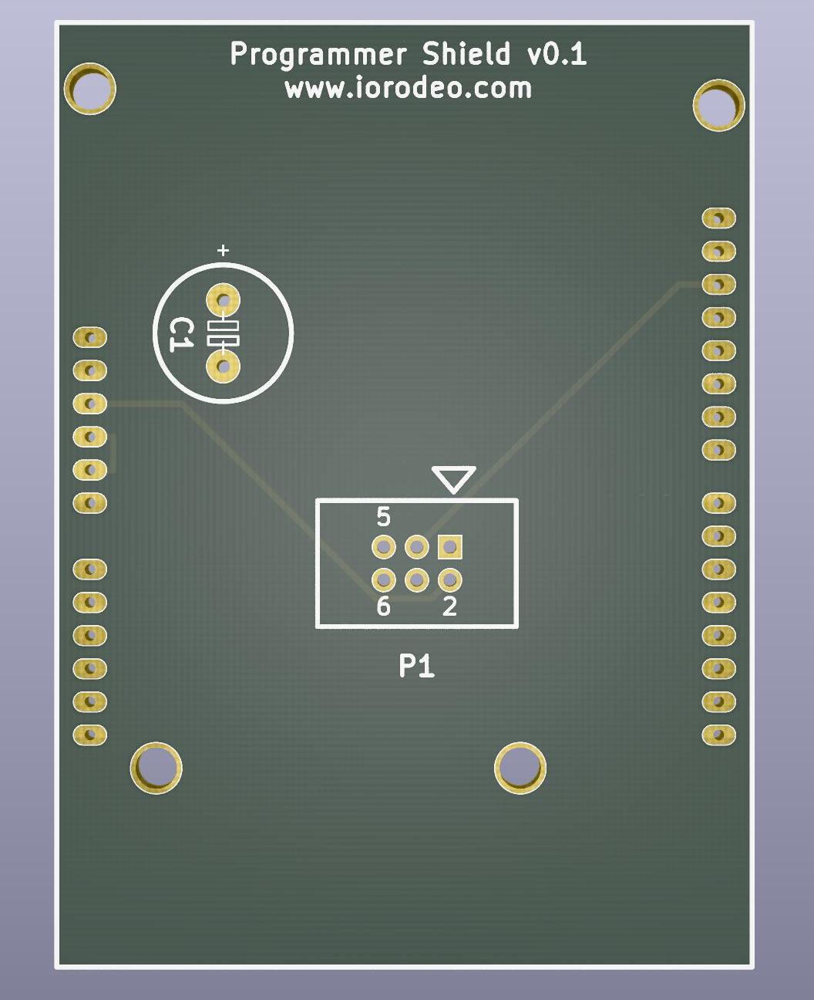
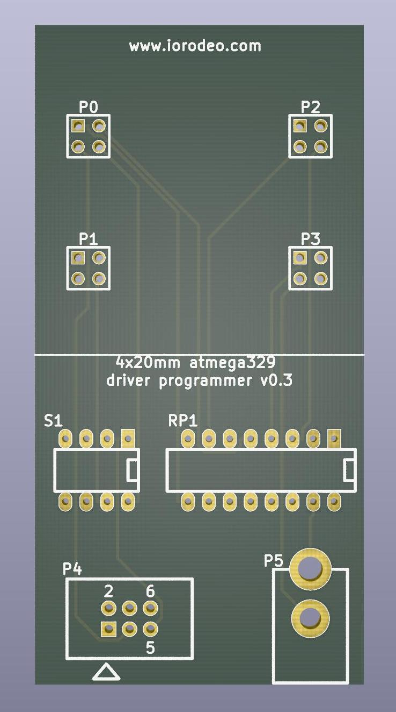
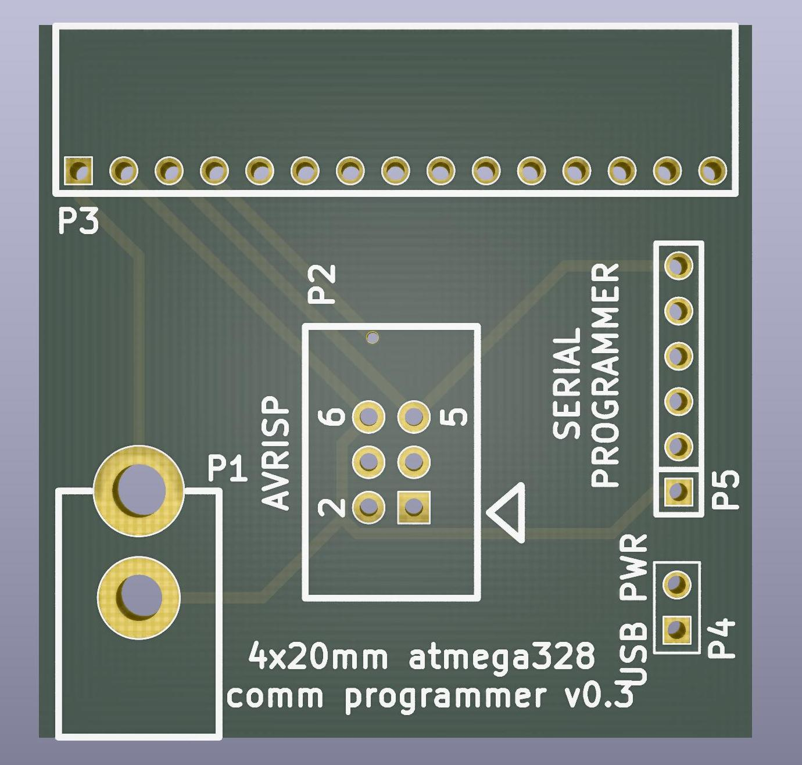

# Programmer

The programmer is built from 3 PCB: An Arduino shield, the comm programmer, and the driver programmer. The three boards are designed to be assembled by hand: These simple 2-layer boards use very few through-hole components and only one of each board is needed for the setup of an arena. 

The use of the programmer will be explained in more detail in another section, but general principle is as follows: The Arduino shield needs to be mounted on an Arduino. The same shield can be used for programming the communication boards and the driver boards. Connect the corresponding programmer board via a ribbon cable to the Arduino shield, and the board you want to program to the programmer board.

{::comment}TODO: Add link to firmware flashing section{:/comment}
{::comment}TODO: Add images with of what programming looks like{:/comment}

## Arduino shield
{:#arduino}

{:.ifr}

The Arduino programming shield measures 72.39×53.34mm². The gerber files and a drill file of the most recent [version v0.1](https://github.com/floesche/panels_g4_hardware/tree/master/atmega328/four_panel/20mm_matrix/ver3/programmer/prog_shield/gerber_v0p1) are the same as in the zip file, ready to be sent to the manufacturer. 

### Function

The basic functionality of the Arduino shield is to convert the signals from the Arduino connectors on the side the ribbon connector (P1).

## Driver board shield
{:#driver .clear}

{:.ifr}

The driver programmer has double the size of a panel board, it is 40×80mm².

The most recent version of the production files is [version v0.3](https://github.com/floesche/panels_g4_hardware/tree/master/atmega328/four_panel/20mm_matrix/ver3/programmer/driver_programmer/gerber_v0p3). Once again this directory contains a zip file ready to be used with a manufacturer. The production files contain gerber files, a drill file, and a BOM.

### Function

The shield adapts the signal from the ribbon connector (P4) to the four driver board connectors (P0…P3), while also powering the driver board during programming (P5). The switch (S1) allows to select which driver MCU will be programmed (usually all 4 are on).

## Comm board shield
{:#comm .clear}

{:.ifr}

With 40×40mm² the PCB for the communication board programmer has the same dimensions as a communication board or a driver board.
  
Production files for the communication board programmer are available in [version v0.3](https://github.com/floesche/panels_g4_hardware/tree/master/atmega328/four_panel/20mm_matrix/ver3/programmer/comm_programmer/gerber_v0p3), also as a zip file ready for submission. The production files contain the gerber files, drill file, and a "Bill of Materials" (BOM) as an xlsx file (Office Open XML format used by Microsoft Office). 

### Function

The shield adapt the signal from the Arduino (P2) to the communication board connector (P3), while also powering the communication board during programming (P1).

# Design

The texts for the programmers and communication board include links directly to the directory containing production files. From there you can navigate one directory up to see the [KiCAD](https://kicad-pcb.org/) EDA source files, in case you want to modify them. These boards were developed by [IORodeo](https://iorodeo.com) and shared under a creative commons license. The schematics might require remapping of symbols when you first open the files.